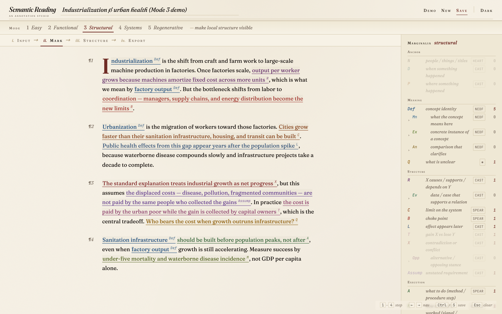
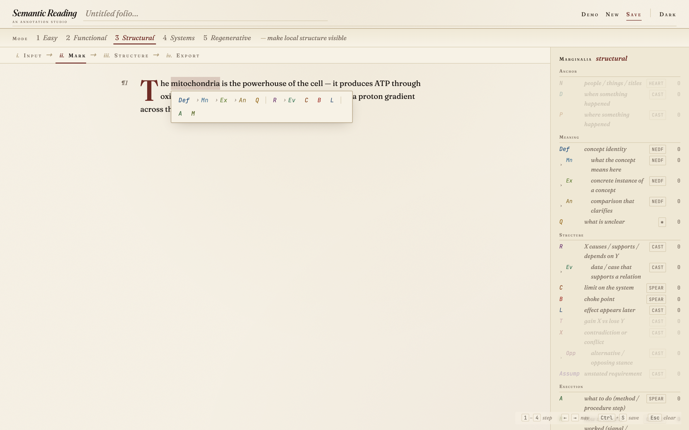
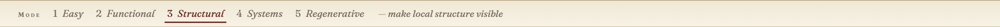
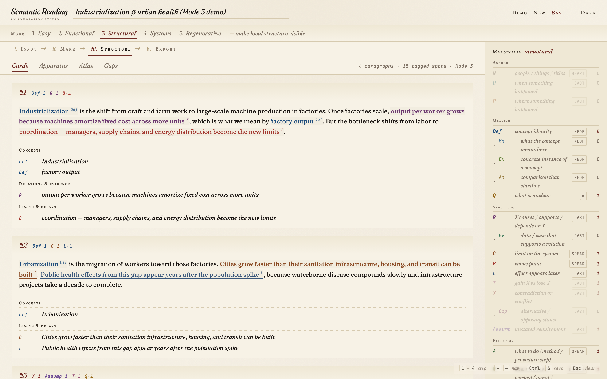
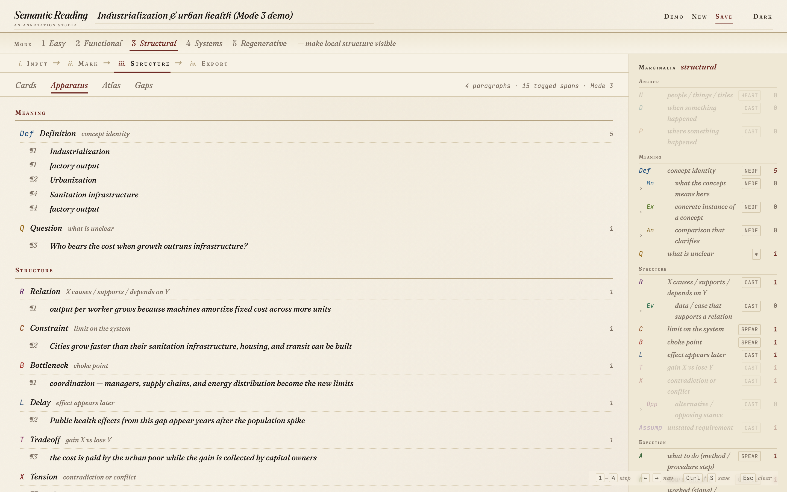
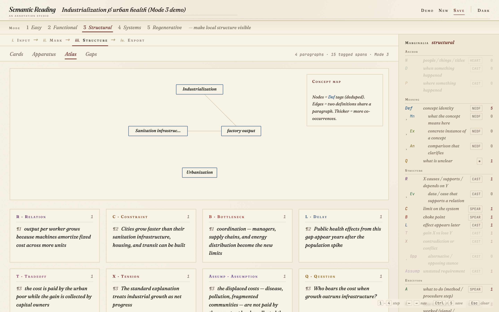
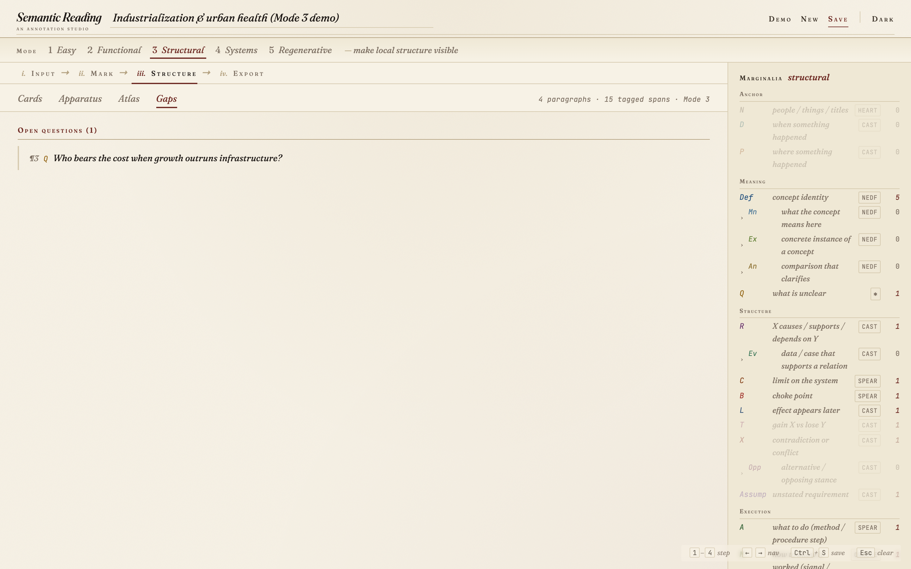
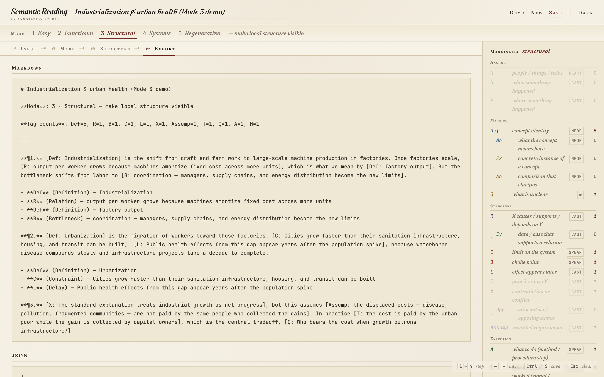
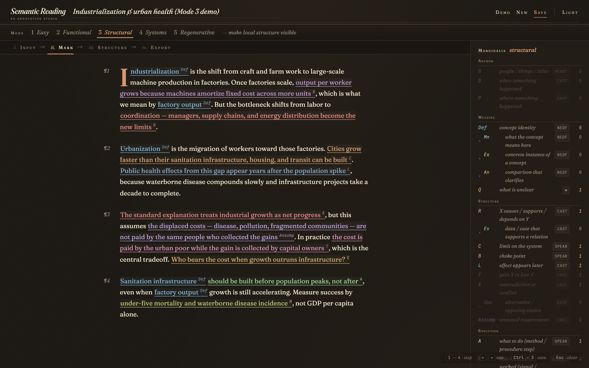

# Semantic Reading — an annotation studio

A small, single-page web app for marking up prose with semantic sigils — `Def` for definitions, `R` for relations, `Q` for open questions, `B` for bottlenecks, and so on — and then re-reading the same passage as Cards, Apparatus, an Atlas of concept relationships, or a list of open Gaps.

No build, no dependencies, no server — open `index.html` and go.



## Run it

```bash
git clone https://github.com/<you>/semantic-reading.git
cd semantic-reading
open index.html        # macOS — any modern browser also works
```

Or serve it:

```bash
npm run serve          # http://localhost:3700
```

That's the entire setup. There is no bundler, no JavaScript framework, no API. The whole app is `index.html` + `style.css` + `js/*.js` (≈1.5k lines of code).

## Walkthrough

A short recording from blank input → tagged paragraphs → Structure views → Export lives at [`docs/video/walkthrough.webm`](docs/video/walkthrough.webm) (1.4 MB; click to download and play). Each step has a still further down in this README.

## How it works

### 1. Paste prose, then turn to **Mark**

Select any span of text. A floating palette appears with the sigils available in your current reading mode. Click one — or press its initial letter — to tag the selection.



Clicking an already-tagged span opens a small popup where you can attach a private note, or remove the tag.

### 2. Modes restrict what you can mark

Five modes, escalating from **Easy** (just surface anchors and definitions) to **Regenerative** (rebuild the chapter from structure). Each mode exposes a different subset of the 19 sigils, so you can stay shallow on a first pass and crank it up on a re-read.



| Mode | Name | Use it for |
|------|------|-----------|
| 1 | Easy | First pass — anchors, definitions, examples |
| 2 | Functional | Separate claims from evidence from actions |
| 3 | Structural | Make local structure visible (default) |
| 4 | Systems | Surface constraints, tradeoffs, assumptions |
| 5 | Regenerative | Reconstruct the chapter from its structure |

### 3. **Structure** re-presents your marks four ways

#### Cards — one card per paragraph, tagged spans grouped by family



#### Apparatus — a flat sheet of every tagged span, grouped by tag



#### Atlas — an SVG concept graph of `Def`s and their co-occurrences



Nodes are unique `Def`-tagged spans. Two nodes share an edge when they co-occur in the same paragraph; thicker edges mean more co-occurrences. Side bins list the non-`Def` structural tags.

#### Gaps — your open questions and reader notes



### 4. **Export** to Markdown, JSON, or Anki



The Anki block emits one CSV per *encoding framework* — `NEDF` for concepts, `CAST` for claim/relation graphs, `SPEAR` for procedures, `ORACLE` for measurement. Cross-cutting tags (currently `Q`) are duplicated into every framework that has at least one card, so a single Anki import lands in the right deck regardless of where you study.

### Dark theme



## Sigils

| Family | Sigils |
|--------|--------|
| **Anchor** | `N`ame, `D`ate, `P`lace |
| **Meaning** | `Def`inition + `Mn`eaning / `Ex`ample / `An`alogy; `Q`uestion |
| **Structure** | `R`elation + `Ev`idence; `C`onstraint, `B`ottleneck, `L`ag/delay, `T`radeoff, `X` tension + `Opp`osite-view, `Assump`tion |
| **Execution** | `A`ction, `M`easure |

Children are nested under their parent in the legend, in the tagbar, and in Cards.

## Keyboard

| Key | Action |
|-----|--------|
| `1`–`4` | Switch tab (Input / Mark / Structure / Export) |
| `←` `→` | Step between tabs |
| `Ctrl`/`Cmd`+`S` | Save the current session |
| `Esc` | Clear the selection / dismiss the tagbar / close the note popup |
| Letter with selection | Apply a tag (`d`=Def, `r`=R, `b`=B, `c`=C, `l`=L, `t`=T, `x`=X, `a`=A, `m`=M, `q`=Q, `n`=N, `p`=P, `w`=D-date, `s`=Assump, `e`=Ev, `g`=Ex, `i`=Mn, `y`=An, `o`=Opp) |

A letter is a no-op if the tag it maps to is not in your current mode.

## Architecture

Eight JS modules loaded in dependency order from `index.html`:

```
constants.js → utils.js → state.js → storage.js → segments.js
                                          ↓
                                  export.js → render.js → app.js
```

- `state` — one mutable object: `{ id, title, mode, paragraphs, rawText }`. `paragraphs` is an array of paragraphs; each paragraph is an array of `{ text, tag?, note? }` segments.
- `segments` — pure split/merge/tag-range operations on that array. `mergeAdjacent` is the invariant: identical-tag neighbours are always coalesced.
- `export` — pure data builders: `buildMarkdown`, `buildJson`, `buildAnkiCsvs` (per encoding framework).
- `render` — DOM rebuilders for each view; no business logic.
- `app` — event wiring (tagbar, keyboard, tabs, session list, theme toggle) and the selection → character-offset → `applyTagRange` pipeline.

Sessions persist to `localStorage` under `sr_marker_sessions` (index) and `sr_marker_session_<id>` (body). Theme persists under `sr_marker_theme` and is applied inline before first paint to avoid a flash.

## Tests

Two suites, both run by a single `npm test`:

```bash
npm install
npm test
```

- **Unit suite** — 89 in-browser tests against the pure modules (`utils`, `segments`, `state`, `storage`, `export`, `constants.tagOrder`), wrapped by Playwright via [`tests/unit.spec.js`](tests/unit.spec.js). Open [`test.html`](test.html) directly in a browser to see them annotated and grouped.
- **End-to-end suite** — 45 Playwright tests in [`tests/app.spec.js`](tests/app.spec.js) covering the selection → tag pipeline (including label-length offset drift, the trickiest invariant), mode switching, all four Structure sub-views, note popups, the session list, keyboard shortcuts, theme persistence, and Anki CSV export.

```bash
npx playwright test --ui    # interactive runner
```

## Regenerating the demo media

```bash
npm run demo                # generates docs/img/*.png + docs/video/walkthrough.webm
```

`scripts/with-server.js` spins up the dev server on port 3700 (override with `PORT=…`), `scripts/generate-demo.js` drives Chromium through every capture.

## Companion project — Obsidian plugin

This studio's tagging model is mirrored in an Obsidian plugin distributed via BRAT at <https://github.com/DavidTbilisi/obsidian-semantic-reading> (`{{Tag|text}}` inline syntax, hub pages, Vault Atlas, FSRS review queue, AI Suggest, MCP server). The plugin lives in `obsidian-plugin/` in this repo; the standalone web app lives at the repo root.

## License

MIT.
